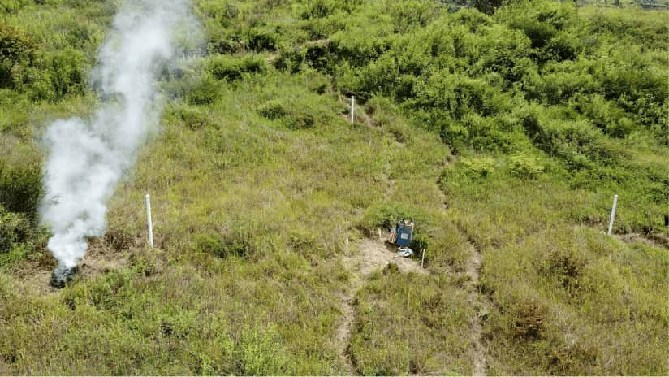
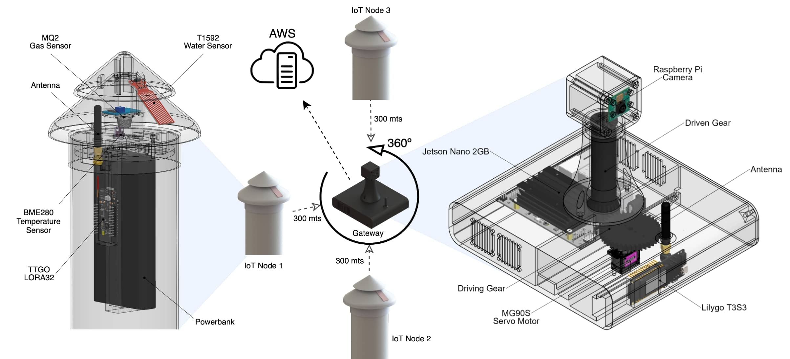
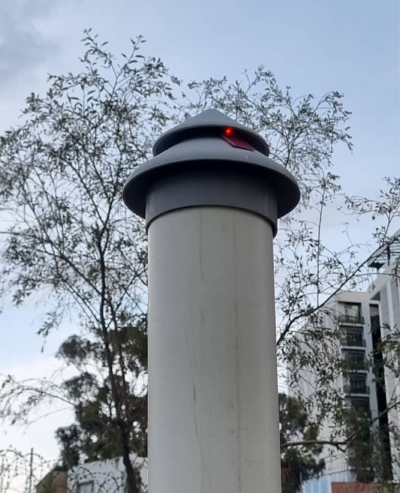
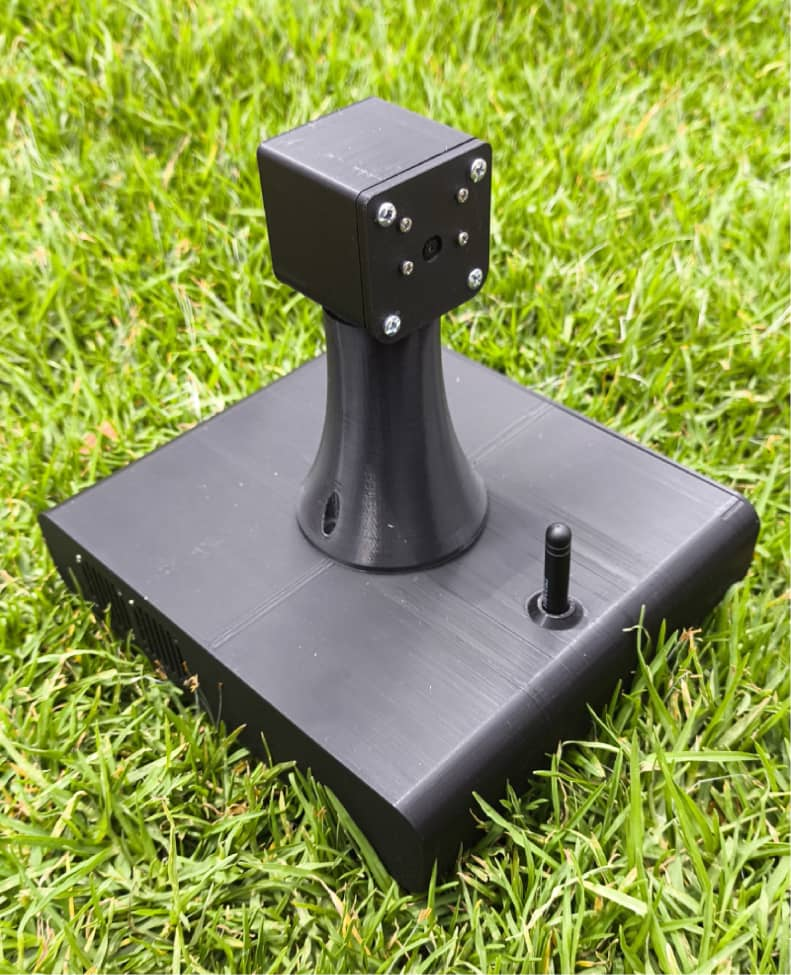
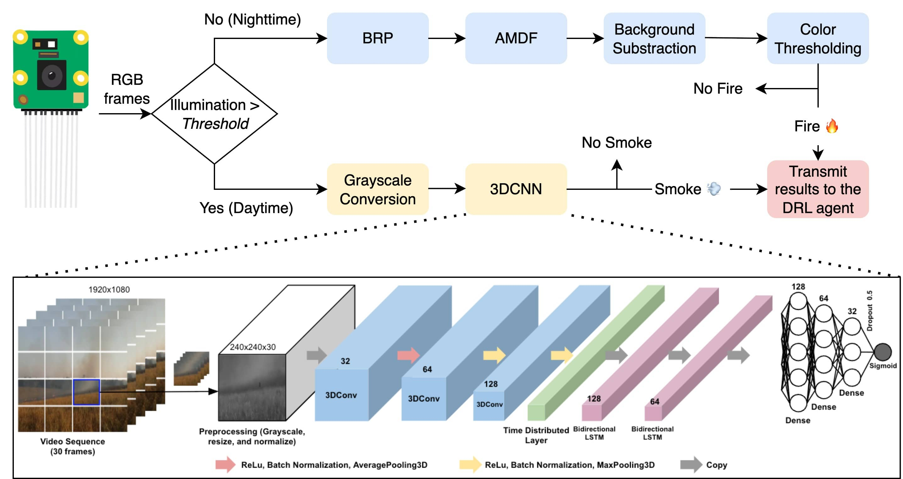
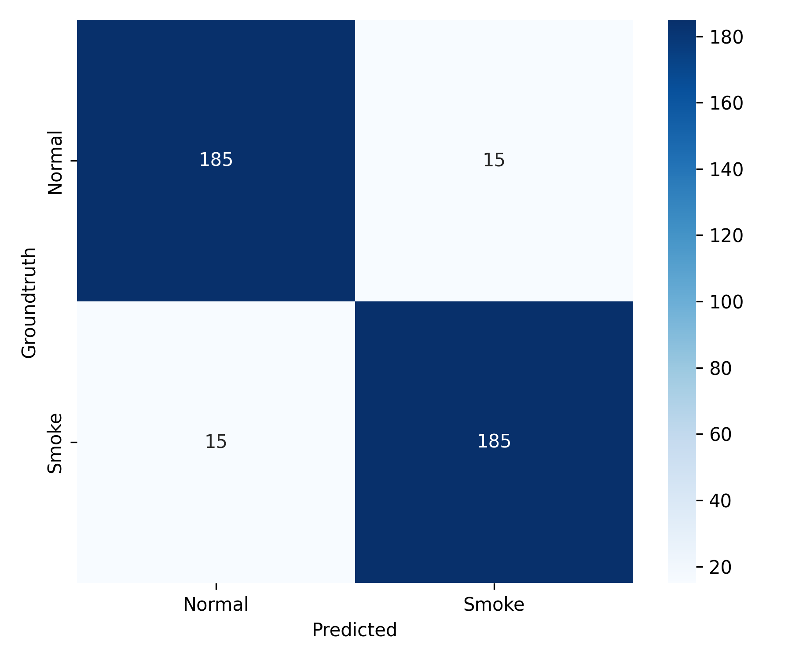
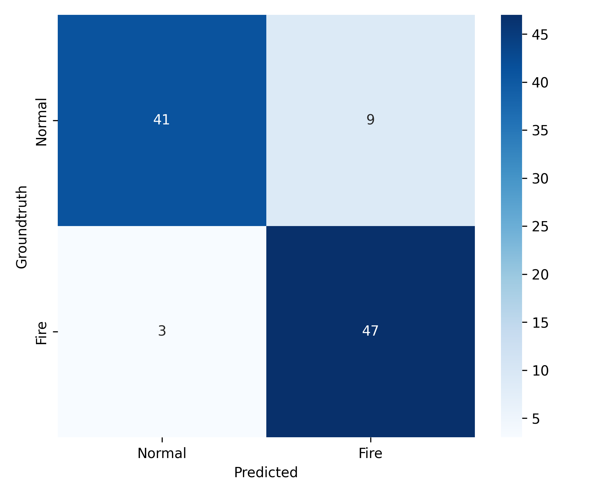

<h1 align="center">ForestProtector: An IoT Architecture Integrating Machine Vision and Deep Reinforcement Learning for Efficient Wildfire Monitoring</h1> 

This repository contains supplementary material for the paper [*"ForestProtector: An IoT Architecture Integrating Machine Vision and Deep Reinforcement Learning for Efficient Wildfire Monitoring"*](https://ieeexplore.ieee.org/document/10977677) (ICARA 2025). **Authors:** [Kenneth Bonilla-Ormachea](https://www.linkedin.com/in/kenneth-bonilla-ormachea-58b7a9240/), [Horacio Cuizaga](https://www.linkedin.com/in/horacuizr/), [Edwin Salcedo](https://www.linkedin.com/in/edwinsalcedo), [Sebastian Castro](https://www.linkedin.com/in/sebastian-castro-3969641a6), [Sergio Fernandez-Testa](https://www.linkedin.com/in/sergio5919/), and [Misael Mamani](https://www.linkedin.com/in/misaelmq680/).  

[[Project Page]](https://edwinsalcedo.com/publication/forest-protector) 
[[arXiv]](https://arxiv.org/abs/2501.09926)
[[Demo Video]](https://youtu.be/jGAHsTo3gg0)

<p align="center">

</p>  

## TL;DR
- **What it is:** A low-cost wildfire monitoring system combining IoT sensor nodes, an edge gateway, and computer vision.
- **What’s new:** A deep reinforcement learning agent actively controls a 360° camera to prioritize high-risk areas using real-time sensor data.
- **What you can do:** Deploy a low-cost wildfire monitoring prototype, test intelligent camera control on the edge, or adapt the architecture for rural and remote monitoring.


## Contents
[1. Overview](#overview) </br>
* [Motivation](#motivation) </br>
* [IoT architecture](#iotarchitecture) </br>
* [Hardware prototype](#hardwareprototype) </br>

[2. Computer vision system](#cvsystem) </br>
* [Datasets](#datasets) </br>
* [Detection metrics](#metrics) </br>
<!-- 
[3. Deep reinforcement learning agent](#drlagent) </br>

[4. Validation](#validation) </br>
-->

[3. Getting started](#gettingstarted) </br>
<!-- * [Initial inference samples](#initialinference) </br> -->

<!-- * [Graphical user interface (GUI)](#gui) </br> -->
<!-- * [On-device deployment](#deployment) </br>   -->

[4. Citation](#citation) </br>
<br>

<a id="overview"></a> 
## 1. Overview

<a id="motivation"></a> 
### Motivation

Early detection of forest fires is crucial to minimizing environmental and socioeconomic damage, as longer-burning fires are significantly harder and costlier to extinguish. However, current detection systems using technologies like remote sensing, PTZ cameras, and UAVs are often expensive and require human involvement, limiting their practicality for continuous large-scale monitoring. To address this, we propose a system that uses a low-cost central gateway with computer vision to monitor a 360° field of view for smoke at long distances. A deep reinforcement learning agent enhances surveillance by dynamically adjusting the camera's orientation based on real-time data from distributed IoT sensors measuring smoke, temperature, and humidity.

<a id="iotarchitecture"></a> 
### IoT architecture
The proposed system architecture consists of two main components: IoT sensor nodes and a central gateway. The sensor nodes, deployed near forests, monitor environmental conditions using various sensors, including those for temperature, humidity, barometric pressure, smoke, and water. The central gateway, based on an NVIDIA Jetson Nano board, collects data from these nodes via the LoRa protocol. The gateway then utilizes a deep reinforcement learning agent to control the gateway camera's perspective, focusing on potential nearby campfires, and employs a computer vision algorithm to verify the presence of smoke in the high-risk region.

<p align="center">

</p>

<a id="hardwareprototype"></a> 
### Hardware prototype

We designed custom enclosures for the IoT nodes and gateway using SolidWorks and 3D-printed them with PETG (Polyethylene Terephthalate Glycol) material. The hardware implementation details for both modules are provided below:

|  <a href="https://github.com/EdwinTSalcedo/ForestProtector/tree/main/iot_node">IoT Node Documentation</a>  |  <a href="https://github.com/EdwinTSalcedo/ForestProtector/tree/main/gateway">Gateway Documentation</a> |   
|---|---|
|<a href="https://github.com/EdwinTSalcedo/ForestProtector/tree/main/iot_node"></a> | <a href="https://github.com/EdwinTSalcedo/ForestProtector/tree/main/gateway"></a> |  

<a id="cvsystem"></a>
## 2. Computer vision system

The 24/7 fire monitoring system comprises two modalities. During the day, it prioritizes smoke detection over fire detection, as smoke is a more visible indicator of wildfires from long distances. To achieve this, we implemented a 3D-CNN trained on a combination of real and synthetic videos of smoke plumes and wildfires captured at various distances. At night, the system prioritizes the detection of bright regions using techniques such as color thresholding, background subtraction, and others to identify fires. The entire computer vision pipeline is depicted below: 

<p align="center">

</p>

<a id="datasets"></a>
### Datasets

The computer vision system required the collection of two dastasets ([available here](https://drive.google.com/drive/folders/16Fxw01cgJtipfyKjr5r_unSuSZd61Ahs?usp=sharing)): 

- **Nighttime Fire Detection (NFD) Dataset**  &rarr; Consists of 100 forest videos captured during nighttime, with and without fire (50 per category). 
- **Smoke Detection (SD) Dataset**  &rarr; To train the 3DCNN, we collected 1,398 forest videos using web scrapping, generative AI, and video editing tools. The following table summarises this dataset. Note that we later augmented this dataset to obtain 2,000 videos per category.

| Class          | Scrapped Videos | AI-generated Videos | Videos Generated with After Effects | Total | Aug.  |
|----------------|------------------|----------------------|--------------------------------------|--------|--------|
| With Smoke     | 108              | 443                  | 184                                  | 735    | 2,000  |
| Without Smoke  | 663              | 0                    | 0                                    | 663    | 2,000  |
| **Total**      | **771**          | **443**              | **184**                              | **1,398** | **4,000** |

<a id="metrics"></a>
### Detection metrics

Our approach achieved accuracies of 92.5% and 88% for daytime and nighttime fire detection, respectively. See the following confusion matrices obtained with the NFD and SD datasets for further analysis.

|  Daytime smoke detection | Nighttime fire detection |   
|---|---|
| |  |  

<!-- 
<a id="dlragent"></a>
## 3. Deep reinforcement learning agent

<a id="validation"></a> 
## 4. Validation -->

<a id="gettingstarted"></a>
## 3. Getting started

This quickstart runs **reproducible, minimal demos** of the daytime smoke detector and nighttime fire detector using the sample videos in `cv/samples`.

### 1. Create and activate the Conda environment
```bash
conda env create -f environment.yml
conda activate forestprotector
```

### 2. Run the unified day/night demo
```bash
python cv/run_demo.py
```

**What to expect**
- Demo auto-detects day vs. night by mean illumination and routes each video to the correct detector.
- Outputs smoke/no-smoke decisions for daytime videos and fire/no-fire decisions for nighttime videos.
- A lightweight demo model is saved to `cv/daytime/models/demo_smoke_model.keras` for repeatable smoke inference.

To run the full research model, replace the demo model with your trained Keras model and keep the same input preprocessing used in `cv/daytime/scripts/smoke_vision_inference.py`.

<!-- 
<a id="initialinference"></a> 
### Initial inference samples

<a id="gui"></a> 
### Graphical User Interface (GUI)

<a id="deployment"></a> 
### On-device deployment -->


<a id="citation"></a>
## 4. Citation

If you find *ForestProtector* useful in your project, please consider citing the following paper:

```
@INPROCEEDINGS{bonilla2025,
  author={Bonilla-Ormachea, Kenneth and Cuizaga, Horacio and Salcedo, Edwin and Castro, Sebastian and Fernandez-Testa, Sergio and Mamani, Misael},
  booktitle={2025 11th International Conference on Automation, Robotics, and Applications (ICARA)}, 
  title={ForestProtector: An IoT Architecture Integrating Machine Vision and Deep Reinforcement Learning for Efficient Wildfire Monitoring}, 
  year={2025},
  volume={},
  number={},
  pages={70-75},
  doi={10.1109/ICARA64554.2025.10977677}}
```
